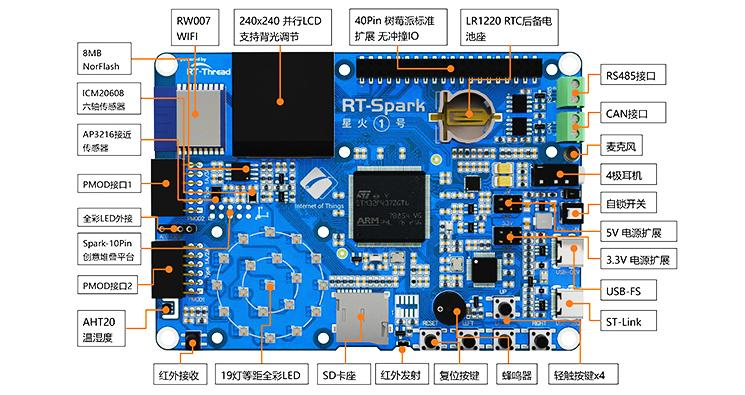

# 开发板简介

“星火 1 号”，一款专为工程师和高校学生设计的嵌入式 **RTOS** 开发学习板。在这个科技飞速发展的时代，嵌入式系统已经成为了现代工业、交通、通信等众多领域的核心驱动力。而 RTOS 实时操作系统作为嵌入式领域的基石，更是工程师们必须熟练掌握的核心技术。作为业界主流的 RTOS 实时操作系统 **RT-Thread**，我们有义务帮助更多开发者掌握这项技术。为此，我们精心打造了一款专为工程师和高校学生设计的嵌入式开发学习板。

# 开发板资源

星火 1 号主控选用了目前行业中比较常用且学习门槛较低的 **STM32F407**，性能强劲、功能丰富，完全能够满足嵌入式入门的需求。此开发板不仅具有众多的板载资源（Flash 存储、WIFI 通信、多个传感器），还支持丰富的扩展接口，让您轻松实现各种复杂的应用场景。通过使用这款开发学习板，您将能够深入了解 RTOS/RT-Thread 的工作原理，提升自己的技能水平，为当前以及未来的职业生涯做好充分准备。

* github 仓库地址 ： https://github.com/RT-Thread-Studio/sdk-bsp-stm32f407-spark

* gitee 仓库地址 ： https://gitee.com/RT-Thread-Studio-Mirror/sdk-bsp-stm32f407-spark
